Chi tiết về bài viết, bạn có thể tham khảo tại: http://thuc.com.vn/relay-cong-tac-dien-va-cach-dung/

# Relay guide notes

Relay is a electrical switch, that used to turn on/off the current by electrical signal. Relay is also used to control a circuit by a low-power signal (with complete electrical isolation between control and controlled circuits).

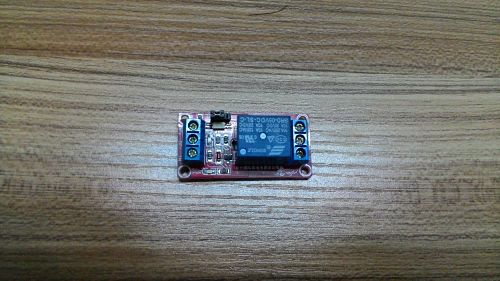
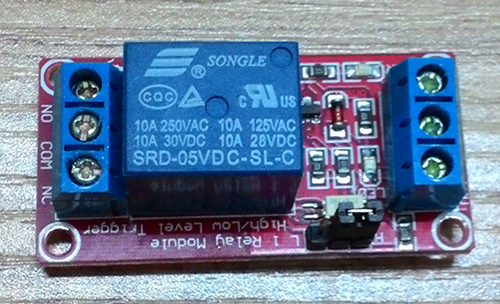
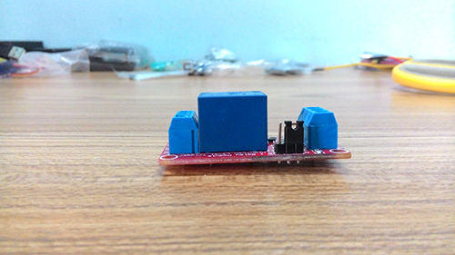
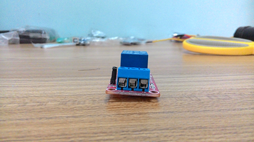
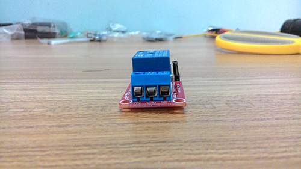
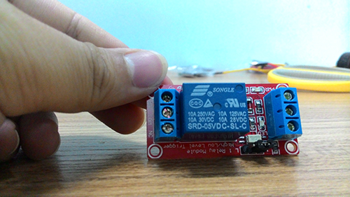

In relay's body, you can see the descriptions:
+ 10A 250VAC.
+ 10A 125VAC.
+ 10A 30VDC.
+ 10A 28VDC.
+ SRD-05VDC-SL-C.

They mean:
+ 10A 250VAC: The max current intensity of connection, where voltage is equal or lesser 250V (AC), is 10A.
+ 10A 125VAC: The max current intensity of connection, where voltage is equal or lesser 125V (AC), is 10A.
+ 10A 30VDC: The max current intensity of connection, where voltage is equal or lesser 30V (DC), is 10A.
+ 10A 28VDC: The max current intensity of connection, where voltage is equal or lesser 28V (DC), is 10A.
+ SRD-05VDC-SL-C: Voltage of signal to control circuit is 5V.

# State of relay

Because relay is a switch, it has two main state: closed and open.
+ Closed: While closing, the relay allows keep current in circuit. It called is "closed circuit".
+ Open: While openning, the relay interupt circuit and current doesn't work in circuit. It called is "open circuit".

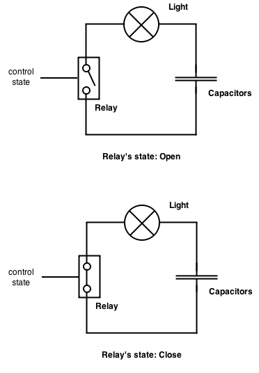

# Relay's connections

In relay, we have six connections. three is used to control the state of relay, three used to connect to circuit (to make circuit is closed or open)

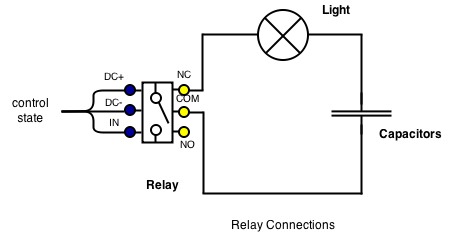

Three connections are used to control the state of relay:
+ DC+: Electrode positive. In this article, we connect wire with 5V to this connection.
+ DC-: Electrode positive. Connect to GND.
+ IN: Signal connection that is used to control relay.

Three connections are used to connect to circuit:
+ COM (Common Connection): Connect to power supply. If it's DC, we frequently connect it to positive of power supply. If it's AC, we frequently connect it to hot wire.
+ NC (Normally Close): Connect to COM connection when don't have any trigger int relay. If we connected this connection to wire and don't trigger relay with IN connection, COM and NC will be connected. When we trigger relay with IN connection, COM and NC will be currupted.
+ NO (Normally Open): Only connect to COM connection when having trigger in relay. If we connected this connection to wire and don't trigger relay with IN connection, COM and NO will be corrupted. When we trigger relay with IN connection, COM and NC will be connected.

Usally, you will use either NC or NO with COM to control circuit. To understand how to NC, NO and COM work, we can see following pictures:

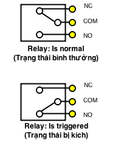

# Trigger relay
Để kích hoạt relay (COM kết nối nối qua NO và ngắt kết nối với NC), ta thông qua chân IN để làm việc này. Trước khi nói về chân IN, chúng ta nên biết là có 2 loại relay, một loại lích hoạt kiểu thấp (LOW) và một loại kích hoạt kiểu cao (HIGH). Chúng ảnh hưởng trực tiếp đến cách thức kích relay trên chân IN.

## Relay kích hoạt kiểu thấp (LOW)
Với loại relay này, khi chúng ta kết nối chân IN với GND (nối đất, cực âm, 0V), relay sẽ được kích. Lúc đó COM sẽ kết nối vào NO và ngắt kết nối với NC. Khi chúng ta kết nối chân IN với cực dương 3.3V-5V, relay sẽ ở trạng thái bình thường. Lúc này COM sẽ kế nối vào NC và ngắt kết nối với NO


## Relay kích hoạt kiểu cao (HIGH)

Với loại relay này, khi chúng ta kết nối chân IN với GND (nối đất, cực âm, 0V), relay sẽ ở trạng thái bình thường (không được kích). Lúc đó COM sẽ kết nối vào NO và ngắt kết nối với NO. Khi chúng ta kết nối chân IN với cực dương 3.3V-5V, relay sẽ ở trạng thái kích. Lúc này COM sẽ kế nối vào NC và ngắt kết nối với NC

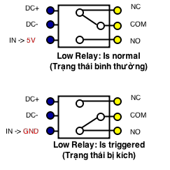

Vậy làm sao để phân biệt Relay bạn đang xài là kích hoạt kiểu LOW hay HIGH. Có 3 cách:
+ Hỏi người bán, người bán là người biết rõ về thứ họ bán cho bạn. Trừ khi họ nhầm lẫn :D
+ Tìm kiếm thông tin về transistor của relay đang dùng. Nếu transistor đó là loại NPN thì đấy chính là relay được kích hoạt ở mức HIGH. Nếu transistor đó là loại PNP thì đấy là relay được kích hoạt ở mức LOW.
+ Dùng thiết bị đo các chân hoặc cấp nguồn thử.


## Ví dụ thực tế

> Lưu ý: Ví dụ dưới đây có sử dụng đến dòng điện xoay chiều 220V. Nếu bạn không có nhiều những kinh nghiệm và kiến thức về nó, xin đừng thực hiện. Không nên làm những gì mình chưa hiểu rõ, nhất là với điện :) Nếu bạn quyết tâm làm, nhớ bảo vệ mình và hết sức cẩn thận.

Giả sử bạn có một bóng đèn dây tóc, sử dụng dòng điện xoay chiều 220V. Bạn muốn dùng mạch microcontroller arduino uno để điều khiển việc cứ sau mỗi 5 giây, đèn sẽ là bật hoặc tắt. 

Như bạn đã biết, aruidno uno chỉ cho phép bạn cung cấp dòng điện 5V ra chân OUTPUT. Với 5V này, bạn không cung cấp đủ điện thế cho bóng đèn dây tóc 220V sáng lên được. Vì vậy, bạn phải sử dụng một nguồn điện khác, mạng lưới điện 220V nhà bạn đang xài đủ tiêu chuẩn để làm việc đó. Nhưng làm sao bạn có thể điều khiển dòng điện 220V của nhà bạn để bóng đèn có thể bật hoặc tắt sau 5 giây được? Relay sẽ giúp bạn làm điều này.

### Chuẩn bị:
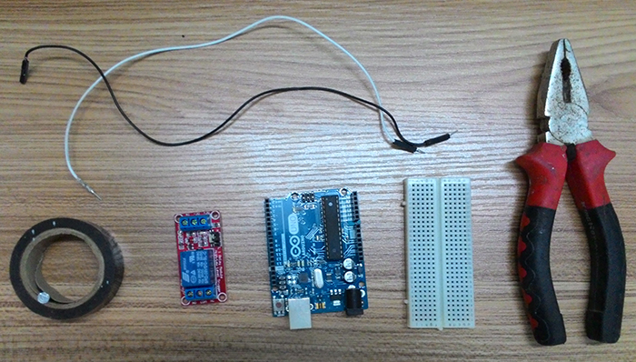
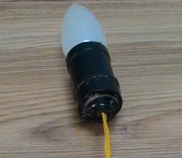

+ Arduino Uno Board (+ dây cắm máy tính)
+ Relay (trong ví dụ này mình dùng relay được kích ở mức LOW)
+ Dây cắm giữa Arduino uno và relay
+ Breadboard (nếu bạn muốn xài, trong ví dụ này mình không sử dụng breadboard)
+ Kềm, băng keo điện
+ Đèn

### Kết nối

Arduino kết nối với Relay theo sơ đồ sau:

| Aruino Pins    | Relay connections  |
| -------------- | ------------------ |
| 5V             | DC+                |
| GND            | DC-                |
| chân digital 7 | IN                 |

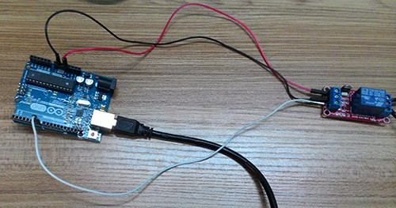
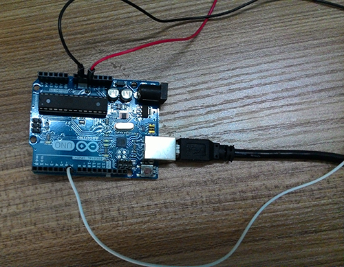
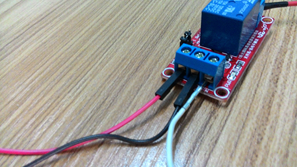


Relay kết nối với mạch theo sơ đồ sau:

| Relay connections | Circuit                               |
| ----------------- | ------------------------------------- |
| COM               | Dây nóng của nguồn điện (dây màu đỏ)  |
| NC                | Nối vào 1 đầu của bóng đèn            |

Đầu còn lại của bóng đèn thì nối vào dây trung hòa của nguồn điện

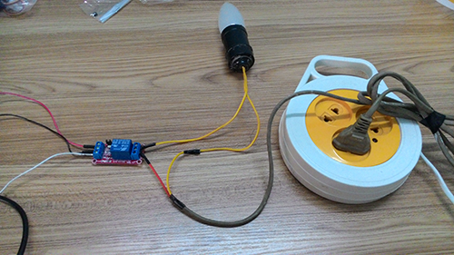
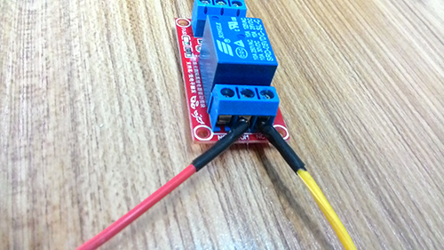

### Code

Do relay của mình kích ở mức LOW nên muốn bật đèn, mình sẽ write state LOW vào chân 7 của Arduino Uno. Muốn tắt đèn, mình sẽ write state HIGH vào chân 7 của Arduino.

Mình có viết một đoạn code nhỏ để demo ví dụ trên

```c++
int relayPin = 7;

void setup() {
  pinMode(relayPin, OUTPUT);
}

void loop() {
  digitalWrite(relayPin, LOW);
  delay(3000);
    digitalWrite(relayPin, HIGH);
  delay(3000);
}
```

### Hình kết quả

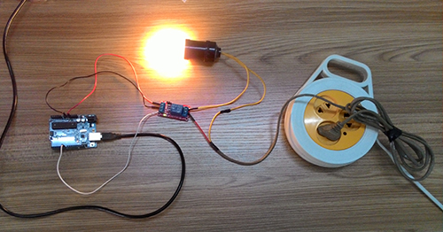


### Video
Để tiện đường coi, mình có quay một đoạn video nhỏ để các bạn tiện coi.
http://youtu.be/81GHj-mZJ5w

[](https://www.youtube.com/watch?v=81GHj-mZJ5w)
